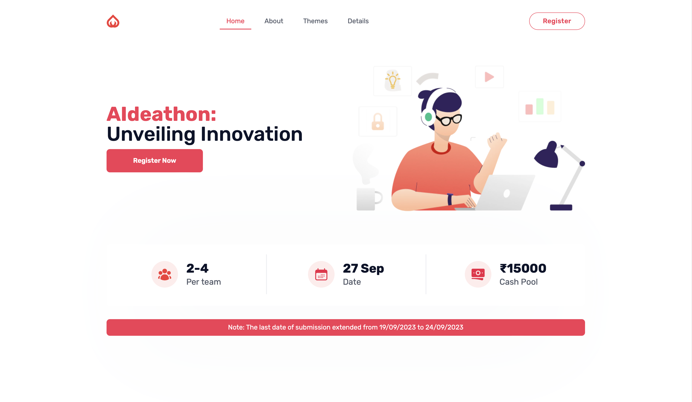

# [Ideathon Landing Page](https://ideathon.bhuvansa.com/) - Official Landing Page for College Ideathon

The Ideathon Landing Page is an open-source, event landing page built using [Tailwind CSS](https://tailwindcss.com/) and [NextJS](https://nextjs.org/) designed and coded for our college's Ideathon event.

## Getting Started

Choose one of the following options to get started:

- [Download the latest release](https://github.com/BhuvanSA/ideathon-landingpage/releases/latest)
- Clone the repo: `git clone https://github.com/BhuvanSA/ideathon-landingpage.git`
- Fork the repo

## About the Template

- Template built using NextJS and Tailwind CSS
- Routing handled by NextJS /pages router

## Running the Application

- Run the application in development mode: `npm run dev`
- Build the application for production: `npm run build`
- Start the application in production mode: `npm run start`

## Features

- Publicly accessible at [https://ideathon.bhuvansa.com/](https://ideathon.bhuvansa.com/)
- Utilizes Next.js's file-system based routing under the `/pages` directory. This allows for automatic routing based on the file and directory structure, making it easy to structure and navigate the application.

## Bugs and Issues

Have a bug or an issue with this template? [Open a new issue](https://github.com/BhuvanSA/ideathon-landingpage/issues/new) here on GitHub.

## Creator

[Ideathon Landing Page](https://ideathon.bhuvansa.com/) was designed and coded by **[me](https://github.com/BhuvanSA/)**

## Copyright and License

Code released under the GNU GENERAL PUBLIC LICENSE.